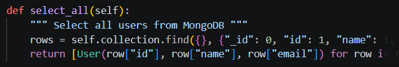
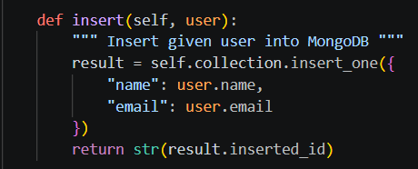
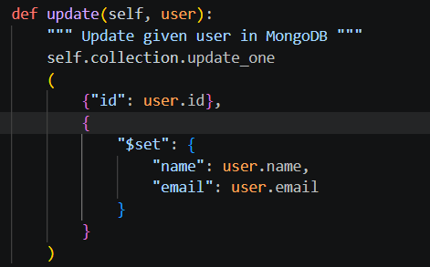
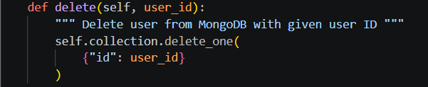
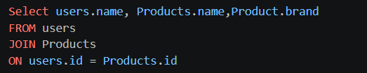

ÉTS - LOG430 - Architecture logicielle - Été 2026

Étudiant(e) : Chris-Emmanuel Berton

# Questions
(Il est obligatoire d'ajouter du code, des captures d'écran ou des sorties de terminal pour illustrer chacune de vos réponses.)

## 1.  Question 1 : Quelles commandes avez-vous utilisées pour effectuer les opérations UPDATE et DELETE dans MySQL ? Avez-vous uniquement utilisé Python ou également du SQL ? Veuillez inclure le code pour illustrer votre réponse.

Pour MySQL, les commandes utilisées sont autant du Python que du SQL. Pour le Python, on utilise la commande self.cursor.execute pour traiter la commande SQL suivante et la commande SQL sont :

## 2.  Question 2 : Quelles commandes avez-vous utilisées pour effectuer les opérations dans MongoDB ? Avez-vous uniquement utilisé Python ou également du SQL ? Veuillez inclure le code pour illustrer votre réponse.
Contrairement à MySQL, il n'y a pas de commande intermédiare pour transitionner entre le Python et la commande MongoDB. Cette différence s'observe par l'absence d'une commande comme self.cursor.execute

 

## 3.  Question 3 : Comment avez-vous implémenté votre product_view.py ? Est-ce qu’il importe directement la ProductDAO ? Veuillez inclure le code pour illustrer votre réponse.
Réponse

##  Question 4 : Si nous devions créer une application permettant d’associer des achats d'articles aux utilisateurs (Users → Products), comment structurerions-nous les données dans MySQL par rapport à MongoDB ?
Contrairement à MySQL où l'association serait par une table de jointure, l'association avec MongoDB se ferait à l'aide d'imbrications de données.

# Déploiement
(Le cas échéant, décrivez votre pipeline CI/CD et ce que vous avez appris dans ce laboratoire en ce qui concerne le déploiement. Il est obligatoire d'ajouter du code, des captures d'écran ou des sorties de terminal pour illustrer votre réponse.)